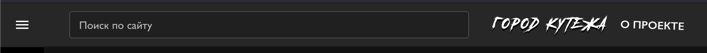
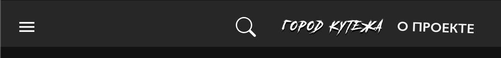
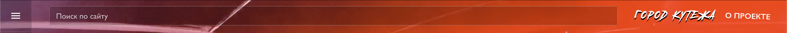

# Header

Основное меню вверху страницы

## Виды

*На широких экранах:*

*На экранах меньше 600px:*

*На главной странице имеет прозрачный фон:*

## Элементы

1. Кнопка "Открыть меню".
2. Поиск по сайту.
3. Логотип сайте.
4. Кнопка "О проекте"

## Кнопка "Открыть меню"

- При наведении — всплывающая подсказка с текстом "Открыть меню".
- По нажатию открывается Меню сайта (компонент NavBar).

## Поиск по сайту

- Поле позволяет ввести строку для поиска по сайту.
- Если экран меньше 600px, вместо поля отображается Кнопка с лупой. По нажатию открывается модальное окно с Поиском.

## Логотип сайта

- По нажатию осуществляется переход на Главную страницу (Main page) сайта.

## Кнопка "О проекте"

- По нажатию осуществляется переход на страницу "О проекте" (About).
